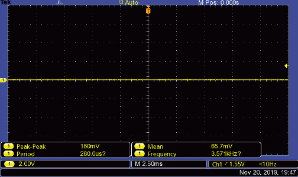
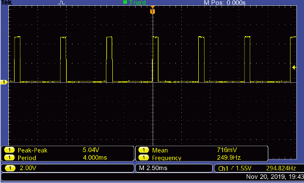
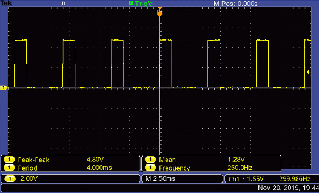
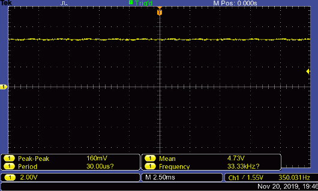
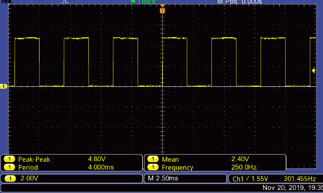

## Aim 
The aim of this was to be able to drive an LED using PWM, a dsPIC30F4011 and the MPLAB X IDE for my Microcontroller Application Group Lab (MAGL) module at university.

## Procedure
Using the datasheet for the dsPIC30F4011 the time peroid could be calculated and then this can then be used to calculat the duty cycle. Getting a duty cycle of 0%, 25%, 50% and 100% is goes as follows:

 This is the PWM signal when the PDC is set to 0%   

 This image of the PWM signal when the PDC set to 50% of Primary master Time-Based Period Register (PTPER). Since the PDC cycle is twice as fast as the duty cycle, PDC needs to be set to twice that of the intended "on/off" cycle. In short, to get this cyle of 25% on 75% off, PDC must be set to 50% of PTPER. 

 This image of the PWM signal when the PDC set equal PTPER. This is to prove the above statement is correct and that PDC must be set to twice PTPER 

 This image of the PWM signal when the PDC set to 200% of Primary master Time-Based Period Register (PTPER). Again, this is just further proof of the above statement 

### Application of theory
An LED was set to flash at rate of 4 times a second. To do this a signal of 250Hz was needed.

 This image of the 250Hz signal being generated. 

### Future works
The skills gained in from this project went on to be drive the motors within small robot built to complete in a micromouse-style challenge.
